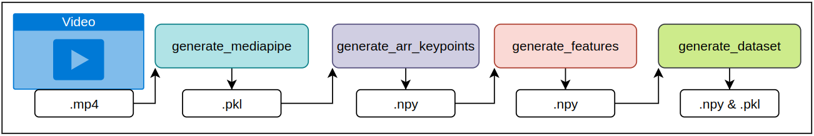

#  SWL-LSE: A Dataset of Spanish Sign Language Health Signs with an ISLR Baseline Method

This repository contains the code necessary to replicate the experiments outlined in the paper "SWL-LSE: A Dataset of Spanish Sign Language Health Signs with an ISLR Baseline Method."

## Repository Structure

The repository is divided into two main sections, each located in different folders:

- **Mediapipe_keypoints**: Contains all the scripts and models used to extract feature vectors from videos and build the datasets for training and evaluation.
- **Msg3d**: Contains the original MSG3D model present in [Github](https://github.com/kenziyuliu/MS-G3D) with some modifications.

## Datasets Used

We employ three datasets:

1. **SWL-SLE**: A newly created dataset available at [Zenodo](https://zenodo.org/records/13691887).
   - Annotation files: [train](datasets/SWL-SLE_anns/train_labels.csv), [val](datasets/SWL-SLE_anns/val_labels.csv), [test](datasets/SWL-SLE_anns/test_labels.csv)
2. **WLASL**: Available at [GitHub](https://github.com/dxli94/WLASL).
   - Annotation files: [train](datasets/WLASL300_anns/train_labels.csv), [val](datasets/WLASL300_anns/val_labels.csv), [test](datasets/WLASL300_anns/test_labels.csv)
   - **WLASL300C**: An extension of WLASL replaced the classes whose labeling in the original version presented numerous anomalies with other better-labeled classes.
     - Annotation files: [train](datasets/WLASL300C_anns/train_labels.csv), [val](datasets/WLASL300C_anns/val_labels.csv), [test](datasets/WLASL300C_anns/test_labels.csv)
3. **ASL-Citizen**: Available at [Microsoft Research](https://www.microsoft.com/en-us/research/project/asl-citizen/).
   - Annotation files: [train](datasets/ASL-Citizen_anns/train_labels.csv), [val](datasets/ASL-Citizen_anns/val_labels.csv), [test](datasets/ASL-Citizen_anns/test_labels.csv)

## Mediapipe Keypoints: Dataset Construction, Feature Extraction, and Preprocessing

This process involves multiple steps in which the Mediapipe model is applied, data is normalized, and the feature vectors are generated to construct the final datasets. Below is the pipeline:



### Key Scripts

#### `generate_mediapipe.py`

```bash
parser.add_argument('--folder_input_videos', required=True, type=str)
parser.add_argument('--pose_hands', action='store_true')
parser.add_argument('--holistic', action='store_true')
parser.add_argument('--holistic_legacy', action='store_true')
parser.add_argument('--folder_output_mediapipe', required=True, type=str)
```

#### `generate_arr_keypoints.py`

```bash
parser.add_argument('--pose_hands', action='store_true')
parser.add_argument('--holistic', action='store_true')
parser.add_argument('--holistic_legacy', action='store_true')
parser.add_argument('--folder_input_mediapipe', default='', type=str)
parser.add_argument('--folder_output_kps', required=True, type=str)
parser.add_argument('--world', action='store_true')
```

The default keypoints array consists of 61 keypoints:

- **Pose Keypoints**: 19
- **Hands (Left & Right)**: 21 each

#### `generate_features.py`

```bash
parser.add_argument('--folder_in_kps', required=True, type=str)
parser.add_argument('--folder_out_features', required=True, type=str)
parser.add_argument('--type_kps', required=False, default='C4_xyzc', type=str)  
parser.add_argument('--offset', action='store_true')  
parser.add_argument('--normalize', action='store_true')  
parser.add_argument('--noFramesLimit', action='store_true')  
parser.add_argument('--jump_reset', action='store_false')
```

#### `generate_dataset.py`

```bash
parser.add_argument('--folder_npy', required=True, type=str)
parser.add_argument('--folder_labels', required=True, type=str)
parser.add_argument('--folder_out', required=True, type=str)
```

## Simple Usage Example: Video + Annotations to Dataset (Step-by-step)

A step-by-step guide to generate a dataset using the Holistic model, producing both normalized and non-normalized datasets.

### Requirements

1. Folder: `ANNOTATIONS` with files: `train_labels.csv`, `val_labels.csv`, `test_labels.csv`
2. Folder: `VIDEOS` with `.mp4` files

### Define paths

```bash
PATH_VIDEOS=BBDD_PATH/VIDEOS
PATH_MEDIAPIPE=BBDD_PATH/MEDIAPIPE
PATH_KEYPOINTS_HL=BBDD_PATH/KEYPOINTS/HL
PATH_FEATURES_HL_NORM=BBDD_PATH/FEATURES/NORM/HL
PATH_FEATURES_HL_NO_NORM=BBDD_PATH/FEATURES/NO_NORM/HL
PATH_DATASET_HL_NORM=BBDD_PATH/DATASET/NORM/HL
PATH_DATASET_HL_NO_NORM=BBDD_PATH/DATASET/NO_NORM/HL
PATH_ANNOTATIONS=BBDD_PATH/ANNOTATIONS
```

### Step 1: Obtain Mediapipe Output (Hands & Pose, Holistic Legacy: "raw output")

```bash
python generate_mediapipe.py --pose_hands --holistic_legacy --folder_input_videos $PATH_VIDEOS --folder_output_mediapipe $PATH_MEDIAPIPE
```

### Step 2.1: Generate Keypoints Array (from Holistic) used in Signamed

```bash
python generate_arr_keypoints.py --holistic_legacy --folder_input_mediapipe $PATH_MEDIAPIPE --folder_output_kps $PATH_KEYPOINTS_HL
```

### Step 3.1: Extract Features (with normalization and angle calculation using z-dimension or discarding z-dimension)

```bash
python generate_features.py --type_kps C4_xyzc --offset --normalize --folder_in_kps $PATH_KEYPOINTS_HL --folder_out_features $PATH_FEATURES_HL_NORM
```

```bash
python generate_features.py --type_kps C3_xyc --offset --normalize --folder_in_kps $PATH_KEYPOINTS_HL --folder_out_features $PATH_FEATURES_HL_NORM
```

### Step 4.1: Build Dataset

```bash
python generate_dataset.py --folder_npy $PATH_FEATURES_HL_NORM --folder_labels $PATH_ANNOTATIONS --folder_out $PATH_DATASET_HL_NORM
```

### Dataset Structure

```
BBDD_PATH
├── ANNOTATIONS
│   ├── train_labels.csv
│   ├── val_labels.csv
│   └── test_labels.csv
├── VIDEOS
│   └── *.mp4
├── MEDIAPIPE
│   └── *.pkl
├── KEYPOINTS
│   └── *.npy
├── FEATURES
│   └── *.npy
└── DATASET
    ├── *.npy
    └── *.pkl
```

## MSG3D: Model

### Key Script

#### `main.py`

```bash
    parser.add_argument('--work-dir', type=str, required=True, help='the work folder for storing results')  
    parser.add_argument('--dataset', type=str, required=True, help='Dataset used')  
    parser.add_argument('--stream', type=str, required=True, help='Stream used')  
    parser.add_argument('--num-classes', type=int, required=True, help='Stream used')  
    parser.add_argument('--config', default='/home/bdd/LSE_Lex40_uvigo/dataconfig/nturgbd-cross-view/test_bone.yaml', help='path to the configuration file')  
    parser.add_argument('--phase', default='train', help='must be train or test')  
    parser.add_argument('--seed', type=int, default=random.randrange(200), help='random seed')    
    parser.add_argument('--weights', default=None, help='the weights for network initialization')  
    parser.add_argument('--ignore-weights', type=str, default=[], nargs='+', help='the name of weights which will be ignored in the initialization')   
    parser.add_argument('--base-lr', type=float, default=0.01, help='initial learning rate')  
    parser.add_argument('--step', type=int, default=[20, 40, 60], nargs='+', help='the epoch where optimizer reduce the learning rate')  
    parser.add_argument('--device', type=int, default=0, nargs='+', help='the indexes of GPUs for training or testing')  
    parser.add_argument('--optimizer', default='SGD', help='type of optimizer')  
    parser.add_argument('--nesterov', type=str2bool, default=False, help='use nesterov or not')  
    parser.add_argument('--batch-size', type=int, default=32, help='training batch size')  
    parser.add_argument('--test-batch-size', type=int, default=256, help='test batch size')  
    parser.add_argument('--forward-batch-size', type=int, default=16, help='Batch size during forward pass, must be factor of --batch-size')  
    parser.add_argument('--num-epoch', type=int, default=80, help='stop training in which epoch')  
    parser.add_argument('--weight-decay', type=float, default=0.0005, help='weight decay for optimizer')  
    parser.add_argument('--use-tta', action='store_true', help='Activate tta - deactivated use only first element in the config file')  
    parser.add_argument('--tta', default=[[False, 1]], help='Config tta')  
    parser.add_argument('--lr-scheduler', default='MultiStepLR', help='type of LR scheduler')  
    parser.add_argument('--gamma', type=float, default=0.1, help='Gamma parameter MultiStepLR')  
    parser.add_argument('--factor', type=float, default=0.1, help='Factor parameter ReduceLROnPlateau')  
    parser.add_argument('--patience', type=int, default=10, help='Patience parameter ReduceLROnPlateau')  
    parser.add_argument('--cooldown', type=int, default=0, help='Cooldown parameter ReduceLROnPlateau')  
    parser.add_argument('--tmax', type=int, default=0, help='tmax parameter CosineAnnealingLR')  
    parser.add_argument('--eta-min', type=float, default=0.0001, help='eta_min parameter CosineAnnealingLR')  
    parser.add_argument('--epoch-warn', type=int, default=0, help='Epoch without scheduler steps')  
    parser.add_argument('--early-stopping', type=int, default=0, help='stop training if not improve in X epochs')  
    parser.add_argument('--use-train-normalization', type=str, default=None, help='Use normalized data and provide the folder where this data is located')  
```

### Training Example

```bash
STREAM=joints_C4_xyzc 
DATASET=/path/to/ASL_Citizen/DATASET/NORM/HP 
DEVICE=5
NUM_CLASSES=300
SEED=42 
ESTUDIO=E0
CONFIG=config/TRAIN_CUSTOM/train.yaml
EXPERIMENT=TRAIN_ASL_CITIZEN_HP/IMAGE_05/$ESTUDIO/$SEED/$STREAM-T1

nohup python main.py --work-dir work_dir/$EXPERIMENT --config $CONFIG --dataset $DATASET --stream $STREAM --num-classes $NUM_CLASSES --device $DEVICE --batch-size 32 --forward-batch-size 32 --test-batch-size 32 --nesterov true --weight-decay 0.0005 --base-lr 0.1 --seed $SEED --use-deterministic --num-worker 50 --early-stopping 30 --step 250 --num-epoch 250 --optimizer 'SGD' --lr-scheduler ReduceLROnPlateau --factor 0.5 --patience 10 --cooldown 0 &
```

### Evaluation and Testing Example

```bash
STREAM=joints_C4_xyzc 
DATASET=/path/to/ASL_Citizen/DATASET/NORM/HP 
DEVICE=5
NUM_CLASSES=300
SEED=42 
ESTUDIO=E0
EXPERIMENT=TRAIN_ASL_CITIZEN_HP/IMAGE_05/$ESTUDIO/$SEED/$STREAM-T1
WEIGHT=work_dir/TRAIN_ASL_CITIZEN_HP/IMAGE_05/E0/42/joints_C3_xyc-T11/weights/weights-110.pt
CONFIG=config/TRAIN_CUSTOM/val.yaml

python main_GTM.py --work-dir eval/$EXPERIMENT --config $CONFIG --weights $WEIGHT --device $DEVICE --test-batch-size 50 --seed $SEED --stream $STREAM --dataset $DATASET --num-classes $NUM_CLASSES
```


```bash
STREAM=joints_C4_xyzc 
DATASET=/path/to/ASL_Citizen/DATASET/NORM/HP 
DEVICE=5
NUM_CLASSES=300
SEED=42 
ESTUDIO=E0
EXPERIMENT=TRAIN_ASL_CITIZEN_HP/IMAGE_05/$ESTUDIO/$SEED/$STREAM-T1
WEIGHT=work_dir/TRAIN_ASL_CITIZEN_HP/IMAGE_05/E0/42/joints_C3_xyc-T11/weights/weights-110.pt
CONFIG=config/TRAIN_CUSTOM/test.yaml

python main_GTM.py --work-dir eval/$EXPERIMENT --config $CONFIG --weights $WEIGHT --device $DEVICE --test-batch-size 50 --seed $SEED --stream $STREAM --dataset $DATASET --num-classes $NUM_CLASSES
```

## Acknowledgements

This repo is based on
  - [MS-G3D] (https://github.com/kenziyuliu/MS-G3D)
  
    ```
    @inproceedings{liu2020disentangling,
      title={Disentangling and Unifying Graph Convolutions for Skeleton-Based Action Recognition},
      author={Liu, Ziyu and Zhang, Hongwen and Chen, Zhenghao and Wang, Zhiyong and Ouyang, Wanli},
      booktitle={Proceedings of the IEEE/CVF Conference on Computer Vision and Pattern Recognition},
      pages={143--152},
      year={2020}
    }
    ```
