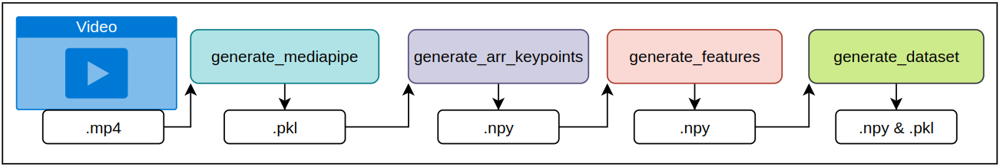
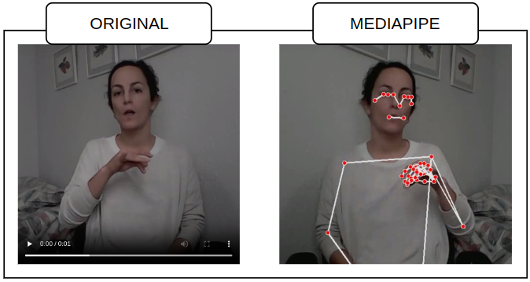

Este repositorio contiene el código necesario para replicar los experimentos recogidos en el trabajo "SWL-LSE: A Dataset of Spanish Sign Language Health Signs with an ISLR Baseline Method" 

# Partes repositorio
El presente repositorio contiene dos bloques diferenciables dispuestos en dos carpetas diferentes:
- Mediapipe_keypoints. Recoge todos los scripts y modelos empleados para extraer los vectores de características de un vídeo y constuir los conjuntos de datos que utilizaremos en el proceso de entrenamiento y evaluación.
- Msg3d. Recoge el modelo MSG3D, parte de la versión original XXXX al que se le han introducido una serie de modificaciones.

## Dataset empleados.
Se presentan 3 datasets:
1. SWL-SLE. Dataset de reciente creación recogido en https://zenodo.org/records/13691887
   Ficheros de anotación: XXXXXXXX
2. WLASL. https://github.com/dxli94/WLASL
    Ficheros de anotación: XXXXXXXX
2.1. WLASL300C. Una extensión de WLASL utilizando los siguiente ficheros de anotación: train, val, test.
    Ficheros de anotación: XXXXXXXXXX
3. ASL-Citizen. https://www.microsoft.com/en-us/research/project/asl-citizen/
    Ficheros de anotación: XXXXXXXXXXX

## MEDIAPIPEKPS. CONSTRUIR DATASET - EXTRAER DE KEYPOINTS, PREPROCESADO, ARRAY DE CARACTERÍSTICAS Y CONSTRUIR DATASET.
Consta de diversas partes en las cuales se aplica el modelo de Mediapipe, se normaliza los datos y generan los vectores de construir con los que se elaboran los dataset finales. Siguiente el pipeline:


## SCRIPTS
## generate_mediapipe
    parser.add_argument('--folder_input_videos', required=True, type=str)
    parser.add_argument('--pose_hands', action='store_true')
    parser.add_argument('--holistic', action='store_true')
    parser.add_argument('--holistic_legacy', action='store_true')
    parser.add_argument('--folder_output_mediapipe', required=True, type=str)


## generate_arr_keypoints
    parser.add_argument('--pose_hands', action='store_true')
    parser.add_argument('--holistic', action='store_true')
    parser.add_argument('--holistic_legacy', action='store_true')
    parser.add_argument('--folder_input_mediapipe', default='', type=str)
    parser.add_argument('--folder_output_kps', required=True, type=str)
    parser.add_argument('--world', action='store_true')

The generation of the keypoints array obtains, por defecto, the array as we use it in Signamed compuesto por 61kps:
- Keypoints pose: 19
- Hands Left: 21
- Hands Right: 21


## generate_features
    parser.add_argument('--folder_in_kps', required=True, type=str)
    parser.add_argument('--folder_out_features', required=True, type=str)
    parser.add_argument('--type_kps', required=False, default='C4_xyzc', type=str)  // [C4_xyzc, C3_xyc, C3_xyz]
    parser.add_argument('--offset', action='store_true')  // Apply offset between wrist of the hand model and pose
    parser.add_argument('--normalize', action='store_true') // Apply normalization based on the shoulders of the skeleton.
    parser.add_argument('--noFramesLimit', action='store_true') // By default, the frame limit is 100, but this restriction can be bypassed.
    parser.add_argument('--jump_reset', action='store_false')

## generate_dataset
    parser.add_argument('--folder_npy', required=True, type=str)
    parser.add_argument('--folder_labels', required=True, type=str)
    parser.add_argument('--folder_out', required=True, type=str)


# SIMPLE USAGE EXAMPLE (Step by step: videos + annotations > dataset )
Ejemplo paso a paso para generar un dataset. Se mostrará el pipeline utilizado en el paper apliando el modelo Holistic y obtienendo tanto un dataset para la salida sin normalizar como la salida normalizada.

## Requerimientos
1. Folder: `ANNOTATIONS` with files:`train_labels.csv`, `val_labels.csv`, `test_labels.csv`
2. Folder: `VIDEOS` with files with extension `.mp4`

## Define paths
```bash
PATH_VIDEOS=BBDD_PATH/VIDEOS
PATH_MEDIAPIPE=BBDD_PATH/MEDIAPIPE
PATH_KEYPOINTS_HL=BBDD_PATH/KEYPOINTS/HL
PATH_FEATURES_HL_NORM=BBDD_PATH/FEATURES/NORM/HL
PATH_FEATURES_HL_NO_NORM=BBDD_PATH/FEATURES/NO_NORM/HL
PATH_DATASET_HL_NORM=BBDD_PATH/DATASET/NORM/HL
PATH_DATASET_HL_NO_NORM=BBDD_PATH/DATASET/NO_NORM/HL

PATH_ANNOTATIONS=BBDD_PATH/ANNOTATIONS
```

### Step 1: Obtain Mediapipe output (Hands & Pose y Holistic Legacy: "raw output")
```bash
python generate_mediapipe.py --pose_hands --holistic_legacy \
    --folder_input_videos $PATH_VIDEOS \
    --folder_output_mediapipe $PATH_MEDIAPIPE
```

### Step 2.1: Obtain array of Keypoints (from Holistic) used in Signamed
```bash
python generate_arr_keypoints.py --holistic_legacy \
    --folder_input_mediapipe $PATH_MEDIAPIPE \
    --folder_output_kps $PATH_KEYPOINTS_HL
```

### Step 3.1: Extract features utilizando para los calculos de normalización y caulculo de los angulos la z (--type_kps C4_xyzc) o descartando la z (--type_kps C3_xyc)
```bash
python generate_features.py --type_kps C4_xyzc --offset --normalize \
    --folder_in_kps $PATH_KEYPOINTS_HL \
    --folder_out_features $PATH_FEATURES_HL_NORM

python generate_features.py --type_kps C3_xyc --offset --normalize \
    --folder_in_kps $PATH_KEYPOINTS_HL \
    --folder_out_features $PATH_FEATURES_HL_NORM
```

### Step 3.2: Extract features sin normalizar por hombros.
```bash
python generate_features.py --type_kps C4_xyzc --offset \
    --folder_in_kps $PATH_KEYPOINTS_HL \
    --folder_out_features $PATH_FEATURES_HL_NO_NORM

python generate_features.py --type_kps C3_xyc --offset \
    --folder_in_kps $PATH_KEYPOINTS_HL \
    --folder_out_features $PATH_FEATURES_HL_NO_NORM
```

**NOTA: ** Cuando se ejecuta generate_features se proporciona la carpeta de salida, si está existe te preguntará si quieres resetearla, como queremos tenemos ambos vectores de características ante dicha pregunta seleccionar "N"

### Paso 4.1: Build dataset
```bash
python generate_dataset.py \
    --folder_npy $PATH_FEATURES_HL_NORM \
    --folder_labels $PATH_ANNOTATIONS \
    --folder_out $PATH_DATASET_HL_NORM
```

```bash
python generate_dataset.py \
    --folder_npy $PATH_FEATURES_HL_NO_NORM \
    --folder_labels $PATH_ANNOTATIONS \
    --folder_out $PATH_DATASET_HL_NO_NORM
```


## Estructura del dataset propuesta:
```
BBDD_PATH
├── ANNOTATIONS
│   ├── train_labels.csv
│   ├── val_labels.csv
│   └── test_labels.csv
├── VIDEOS
│   └── *.mp4
├── MEDIAPIPE
│   └── *.pkl
├── KEYPOINTS
│   └── *.npy
├── FEATURES
│   └── *.npy
└── DATASET
    ├── *.npy
    └── *.pkl
```

## MSG3D.
## SCRIPTS
## main.py
    parser.add_argument('--work-dir', type=str, required=True, help='the work folder for storing results')  
    parser.add_argument('--dataset', type=str, required=True, help='Dataset used')  
    parser.add_argument('--stream', type=str, required=True, help='Stream used')  
    parser.add_argument('--num-classes', type=int, required=True, help='Stream used')  
    parser.add_argument('--config', default='/home/bdd/LSE_Lex40_uvigo/dataconfig/nturgbd-cross-view/test_bone.yaml', help='path to the configuration file')  
    parser.add_argument('--phase', default='train', help='must be train or test')  
    parser.add_argument('--seed', type=int, default=random.randrange(200), help='random seed')    
    parser.add_argument('--weights', default=None, help='the weights for network initialization')  
    parser.add_argument('--ignore-weights', type=str, default=[], nargs='+', help='the name of weights which will be ignored in the initialization')   
    parser.add_argument('--base-lr', type=float, default=0.01, help='initial learning rate')  
    parser.add_argument('--step', type=int, default=[20, 40, 60], nargs='+', help='the epoch where optimizer reduce the learning rate')  
    parser.add_argument('--device', type=int, default=0, nargs='+', help='the indexes of GPUs for training or testing')  
    parser.add_argument('--optimizer', default='SGD', help='type of optimizer')  
    parser.add_argument('--nesterov', type=str2bool, default=False, help='use nesterov or not')  
    parser.add_argument('--batch-size', type=int, default=32, help='training batch size')  
    parser.add_argument('--test-batch-size', type=int, default=256, help='test batch size')  
    parser.add_argument('--forward-batch-size', type=int, default=16, help='Batch size during forward pass, must be factor of --batch-size')  
    parser.add_argument('--num-epoch', type=int, default=80, help='stop training in which epoch')  
    parser.add_argument('--weight-decay', type=float, default=0.0005, help='weight decay for optimizer')  
    parser.add_argument('--use-tta', action='store_true', help='Activate tta - deactivated use only first element in the config file')  
    parser.add_argument('--tta', default=[[False, 1]], help='Config tta')  
    parser.add_argument('--lr-scheduler', default='MultiStepLR', help='type of LR scheduler')  
    parser.add_argument('--gamma', type=float, default=0.1, help='Gamma parameter MultiStepLR')  
    parser.add_argument('--factor', type=float, default=0.1, help='Factor parameter ReduceLROnPlateau')  
    parser.add_argument('--patience', type=int, default=10, help='Patience parameter ReduceLROnPlateau')  
    parser.add_argument('--cooldown', type=int, default=0, help='Cooldown parameter ReduceLROnPlateau')  
    parser.add_argument('--tmax', type=int, default=0, help='tmax parameter CosineAnnealingLR')  
    parser.add_argument('--eta-min', type=float, default=0.0001, help='eta_min parameter CosineAnnealingLR')  
    parser.add_argument('--epoch-warn', type=int, default=0, help='Epoch without scheduler steps')  
    parser.add_argument('--early-stopping', type=int, default=0, help='stop training if not improve in X epochs')  
    parser.add_argument('--use-train-normalization', type=str, default=None, help='Use normalized data and provide the folder where this data is located')  


# TRAIN
STREAM=joints_C4_xyzc 
DATASET=/home/tmpvideos/mvazquez/ISLR_bbdd/ASL_Citizen_JULIO_2024/DATASET/NORM/HP 
DEVICE=5
NUM_CLASSES=2731
SEED=42 
ESTUDIO=E0
CONFIG=config/TRAIN_CUSTOM/train.yaml
EXPERIMENT=TRAIN_ASL_CITIZEN_HP/IMAGE_05/$ESTUDIO/$SEED/$STREAM-T1

nohup python main.py --work-dir work_dir/$EXPERIMENT --config $CONFIG --dataset $DATASET --stream $STREAM --num-classes $NUM_CLASSES --device $DEVICE --batch-size 32 --forward-batch-size 32 --test-batch-size 32 --nesterov true --weight-decay 0.0005 --base-lr 0.1 --seed $SEED --use-deterministic --num-worker 50 --early-stopping 30 --step 250 --num-epoch 250 --optimizer 'SGD' --lr-scheduler ReduceLROnPlateau --factor 0.5 --patience 10 --cooldown 0 &

echo $EXPERIMENT


# EVALUATION
## EVAL
STREAM=joints_C4_xyzc 
DATASET=/home/tmpvideos/mvazquez/ISLR_bbdd/ASL_Citizen_JULIO_2024/DATASET/NORM/HP 
DEVICE=5
NUM_CLASSES=2731
SEED=42 
ESTUDIO=E0
EXPERIMENT=TRAIN_ASL_CITIZEN_HP/IMAGE_05/$ESTUDIO/$SEED/$STREAM-T1
WEIGHT=work_dir/TRAIN_ASL_CITIZEN_HP/IMAGE_05/E0/42/joints_C3_xyc-T11/weights/weights-110.pt
CONFIG=config/TRAIN_CUSTOM/val.yaml

python main_GTM.py --work-dir eval/$EXPERIMENT --config $CONFIG --weights $WEIGHT --device $DEVICE --test-batch-size 50 --seed $SEED --stream $STREAM --dataset $DATASET --num-classes $NUM_CLASSES


## TEST
STREAM=joints_C4_xyzc 
DATASET=/home/tmpvideos/mvazquez/ISLR_bbdd/ASL_Citizen_JULIO_2024/DATASET/NORM/HP 
DEVICE=5
NUM_CLASSES=2731
SEED=42 
ESTUDIO=E0
EXPERIMENT=TRAIN_ASL_CITIZEN_HP/IMAGE_05/$ESTUDIO/$SEED/$STREAM-T1
WEIGHT=work_dir/TRAIN_ASL_CITIZEN_HP/IMAGE_05/E0/42/joints_C3_xyc-T11/weights/weights-110.pt
CONFIG=config/TRAIN_CUSTOM/test.yaml

python main_GTM.py --work-dir eval/$EXPERIMENT --config $CONFIG --weights $WEIGHT --device $DEVICE --test-batch-size 50 --seed $SEED --stream $STREAM --dataset $DATASET --num-classes $NUM_CLASSES


## RESULTS
Excel con los entrenamientos y enlace para descargar cada uno de los entrenamientos.


```
PATH_KEYPOINTS_HL=/home/tmpvideos/mvazquez/ISLR_bbdd/WLASL_JULIO_2024/KEYPOINTS/HL
PATH_FEATURES_HL=/home/tmpvideos/mvazquez/ISLR_bbdd/WLASL_JULIO_2024/FEATURES_2D/NORM/HL
PATH_DATASET_HL=/home/tmpvideos/mvazquez/ISLR_bbdd/WLASL_JULIO_2024/DATASET2D_c300_CUSTOM/NORM/HL
PATH_ANNOTATIONS=/home/tmpvideos/mvazquez/ISLR_bbdd/WLASL_JULIO_2024/ANNOTATIONS/ASL300CUSTOM

python generate_mediapipe.py --holistic_legacy --folder_input_videos ../DATA/VIDEOS_IN --folder_output_mediapipe ../DATA/MEDIAPIPE/HOLISTIC_LEGACY_05


python generate_features.py --type_kps C4_xyzc --offset --normalize \
    --folder_in_kps $PATH_KEYPOINTS_HL \
    --folder_out_features $PATH_FEATURES_HL
python generate_features.py --type_kps C4_xyc --offset --normalize \
    --folder_in_kps $PATH_KEYPOINTS_HL \
    --folder_out_features $PATH_FEATURES_HL
python generate_dataset.py \
    --folder_npy $PATH_FEATURES_HL \
    --folder_labels $PATH_ANNOTATIONS \
    --folder_out $PATH_DATASET_HL


PATH_KEYPOINTS_HL=/home/tmpvideos/mvazquez/ISLR_bbdd/WLASL_JULIO_2024/KEYPOINTS/HL
PATH_FEATURES_HL=/home/tmpvideos/mvazquez/ISLR_bbdd/WLASL_JULIO_2024/FEATURES_2D/NO_NORM/HL
PATH_DATASET_HL=/home/tmpvideos/mvazquez/ISLR_bbdd/WLASL_JULIO_2024/DATASET2D_c300_CUSTOM/NO_NORM/HL
PATH_ANNOTATIONS=/home/tmpvideos/mvazquez/ISLR_bbdd/WLASL_JULIO_2024/ANNOTATIONS/ASL300CUSTOM

python generate_features.py --type_kps C4_xyzc --offset \
    --folder_in_kps $PATH_KEYPOINTS_HL \
    --folder_out_features $PATH_FEATURES_HL
python generate_features.py --type_kps C3_xyc --offset \
    --folder_in_kps $PATH_KEYPOINTS_HL \
    --folder_out_features $PATH_FEATURES_HL
python generate_dataset.py \
    --folder_npy $PATH_FEATURES_HL \
    --folder_labels $PATH_ANNOTATIONS \
    --folder_out $PATH_DATASET_HL
```


## ENTRENAMIENTO.


## INFERENCIA
## VALIDACIÓN


## TEST


## RESULTADOS.


## Uso de Mediapipe

Integra:
1. Mediapipe Holistic (Legacy)
2. Mediapipe Hands & Pose
3. Mediapipe Holistic ( En construcción - la versión actual presenta bugs )

-------

# Requisitos:

- python >= 3.8
- mediapipe >= 0.10.10

-------

# Contenido:

En la carpeta API se integra las diferentes implementación / uso de mediapipe de modo que sea transparente que versión utilizar con unicamente instanciar una u otra clase, clases posibles:
* GenKeypointsPoseHands
* GenKeypointsHolistic
* GenKeypointsHolisticLegacy

Por otro lado, la carpeta API incluye genFeatures con las funciones de preprocesado y adecuación de los keypoints y generación de los diferentes vectores de características que utilizaremos en el entrenamiento/inferencia.

En la carpeta models se incluyen los modelos utilizados con la nueva API de mediapipe, incluyendo la versión "heavy" del modelo de extración de los puntos del cuerpo.

En la carpeta raiz se incluye diferentes scripts:
 - useMediapipeAPI, script todo en uno permite dada una carpeta con vídeos y extraer tanto el vídeo obtenido con mediapipe, como extraer los kps y los vectores de características.
 - generate_mediapipe.py, permite extraer la salida del modelo dada una carpeta de vídeos y guardando esta salida como ficheros .pickle.
 - generate_arr_keypoints.py, a partir de los pickles previamente extraídos se puede obtener ficheros .npy con los keypoints utilizados en Signamed.
 - generate_features.py, permite obtener los vectores de características utilizados en los modelos de Signamed a partir de los ficheros .npy

-------

# Modo de Uso

## useMediapipeAPI


    parser.add_argument('--model', required=True, choices=['POSE_HANDS', 'HOLISTIC_LEGACY', 'HOLISTIC'])
    parser.add_argument('--video_path', required=True, type=str)
    parser.add_argument('--folder_out_video', required=False, type=str)
    parser.add_argument('--folder_out_keypoints', required=False, type=str)
    parser.add_argument('--folder_out_features', required=False, type=str)
    parser.add_argument('--type_kps', required=False, default='C4_xyzc', type=str)


python useMediapipeAPI.py --model POSE_HANDS --video_path /home/tmpvideos/mvazquez/ISLR_workspace/KEYPOINTS_MEDIAPIPE/DATA/VIDEOS_IN/ania_lejos.mp4 --folder_out_video ../out_videos --folder_out_keypoints ../out_keypoints

python useMediapipeAPI.py --model HOLISTIC_LEGACY --video_path /home/tmpvideos/mvazquez/ISLR_workspace/KEYPOINTS_MEDIAPIPE/videos_in/ania_lejos.mp4 --folder_out_keypoints ../out_keypoints

# PIPELINE: VIDEOS -> DATASET


## generate_mediapipe

    parser.add_argument('--folder_input_videos', required=True, type=str)
    parser.add_argument('--pose_hands', action='store_true')
    parser.add_argument('--holistic', action='store_true')
    parser.add_argument('--holistic_legacy', action='store_true')
    parser.add_argument('--folder_output_mediapipe', required=True, type=str)

python generate_mediapipe.py --pose_hands --folder_input_videos ../DATA/VIDEOS_IN --folder_output_mediapipe ../DATA/MEDIAPIPE/POSE_HANDS_05

python generate_mediapipe.py --holistic_legacy --folder_input_videos ../DATA/VIDEOS_IN --folder_output_mediapipe ../DATA/MEDIAPIPE/HOLISTIC_LEGACY_05


## generate_arr_keypoints

    parser.add_argument('--pose_hands', action='store_true')
    parser.add_argument('--holistic', action='store_true')
    parser.add_argument('--holistic_legacy', action='store_true')

    parser.add_argument('--folder_input_mediapipe', default='', type=str)
    parser.add_argument('--folder_output_kps', required=True, type=str)

    parser.add_argument('--world', action='store_true')

python generate_arr_keypoints.py --folder_input_mediapipe ../DATA/MEDIAPIPE/POSE_HANDS_05 --pose_hands --folder_output_kps ../DATA/KEYPOINTS/POSE_HANDS_IMAGE_05

python generate_arr_keypoints.py --world --folder_input_mediapipe ../DATA/MEDIAPIPE/POSE_HANDS_05 --pose_hands --folder_output_kps ../DATA/KEYPOINTS/POSE_HANDS_WORLD_05

python generate_arr_keypoints.py --folder_input_mediapipe ../DATA/MEDIAPIPE/HOLISTIC_LEGACY_05 --holistic_legacy --folder_output_kps ../DATA/KEYPOINTS/HOLISTIC_LEGACY_IMAGE_05


## generate_features

    parser.add_argument('--folder_in_kps', required=True, type=str)
    parser.add_argument('--folder_out_features', required=True, type=str)

    parser.add_argument('--type_kps', required=False, default='C4_xyzc', type=str)
    parser.add_argument('--offset', action='store_true')
    parser.add_argument('--normalize', action='store_true')
    parser.add_argument('--noFramesLimit', action='store_true')


python generate_features.py --type_kps C4_xyzc --offset --normalize --folder_in_kps ../DATA/KEYPOINTS/POSE_HANDS_IMAGE_05 --folder_out_features ../DATA/FEATURES/POSE_HANDS_IMAGE_05


